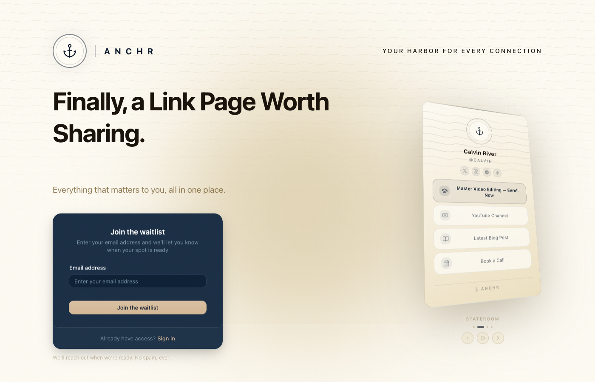
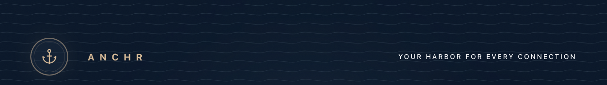

# Anchr Brand Guidelines

## 1. What Is Anchr

A nexus for online identity — connecting scattered profiles, payment handles, and important items into a single place. In an increasingly online world, people place a premium on real human connection. Anchr exists to shorten the distance between a digital presence and a genuine relationship.

**Tagline:** "Your Harbor for Every Connection"

**Positioning:** Identity hub first, redirect router as differentiator. Every feature should ultimately serve the same goal: helping people find each other and connect in ways that matter.

## 2. Executive Direction

- **Built for the builder first** — designed to be a tool the founder wants to use; if others want it, great.
- **North star:** a real product with real users who choose Anchr over alternatives.
- **Design philosophy:** eye-catching and exciting — visitors should pause and take in the page before clicking the link they came for. Twofold value: visually clean for findability, beautiful enough to linger on.
- **Nautical identity:** born from HTML `<a>` anchor tags and domain constraints; grew into the Dark Depths aesthetic (anchor logo, wave motif, navy + gold, sonar-inspired elements). Should stay "just on the right side of understated" — never cheesy.
- **Dark Depths is the primary palette** — the true Anchr identity; Stateroom (light) is a secondary complement.
- **Human connection is the throughline** — every screen, feature, and piece of copy should reinforce that there's a real person on the other side. Anchr is a tool for people to reach people — not a dashboard for managing links.
- **Anti-patterns:**
  - Never corporate/generic — no stock photos, buzzwords, or "solutions" language.
  - Never cheap/cluttered — no ads, upsell banners, feature bloat, or visual noise.

## 3. Color Palette

Eleven brand variables defined in `src/app/globals.css`. These form the visual identity across both themes.

**Dark Depths (dark) is the hero palette.**

#### In context — Dark Depths

#### In context — Stateroom

### Dark spectrum

| Swatch                                                 | Token             | Hex       | Usage                                 |
| ------------------------------------------------------ | ----------------- | --------- | ------------------------------------- |
|  | `brand-deep-navy` | `#0a1729` | Primary background (Dark Depths)      |
|       | `brand-navy`      | `#1e2d42` | Cards, borders, sidebar (Dark Depths) |
|      | `brand-slate`     | `#2d3e56` | Secondary surfaces, muted fills       |

### Cool neutrals

| Swatch                                             | Token         | Hex       | Usage                               |
| -------------------------------------------------- | ------------- | --------- | ----------------------------------- |
|  | `brand-steel` | `#92b0be` | Muted text, ring accents, subtle UI |

### Warm accents

| Swatch                                             | Token         | Hex       | Usage                                     |
| -------------------------------------------------- | ------------- | --------- | ----------------------------------------- |
|   | `brand-gold`  | `#d4b896` | Primary accent (Dark Depths), CTA, glow   |
|  | `brand-brass` | `#a88e58` | Ring accent (Stateroom), secondary warmth |

### Light spectrum

| Swatch                                             | Token         | Hex       | Usage                                             |
| -------------------------------------------------- | ------------- | --------- | ------------------------------------------------- |
|  | `brand-cream` | `#fdfaf2` | Primary background (Stateroom), body text on dark |
|  | `brand-linen` | `#f5edda` | Secondary surfaces (Stateroom), sidebar           |
|   | `brand-sand`  | `#ece0c0` | Borders, input fills (Stateroom)                  |

### Warm darks

| Swatch                                                | Token            | Hex       | Usage                  |
| ----------------------------------------------------- | ---------------- | --------- | ---------------------- |
|  | `brand-espresso` | `#18120a` | Body text (Stateroom)  |
|     | `brand-umber`    | `#785f32` | Muted text (Stateroom) |

#### Link page mockup — Dark Depths palette applied

> **Note:** Anchr also offers user-facing app themes (e.g. Obsidian, Seafoam). These are product features, not brand colors, and are not documented here.

## 4. Logo Usage

### Current mark

The Lucide `Anchor` icon set inside a double-ringed circular frame with a subtle ambient glow. This is a **placeholder** until a custom logomark is commissioned.

### Wordmark

- **Brand contexts:** "ANCHR" in all-caps with wide letter-spacing (`0.55em`).
- **Body text / conversational use:** "Anchr" in standard case (like Tesla — uppercase for branding, mixed case in prose).

### Wave pattern

Repeating sinusoidal SVG waves fill the top of the marketing page, fading out via a vertical mask. The stroke uses `--m-wave-stroke` — a semi-transparent brand color that shifts between themes.

### Sizing

Three variants defined in the `SiteLogo` component (`src/components/marketing/site-logo.tsx`):

| Size | Outer ring | Icon    | Stroke weight |
| ---- | ---------- | ------- | ------------- |
| sm   | 3.5rem     | 1.5rem  | 1.5           |
| md   | 5rem       | 2.25rem | 1.5           |
| lg   | 7rem       | 2.75rem | 1.25          |

### Legal note

The Lucide anchor icon is ISC-licensed (permissive), but a bespoke logomark is the long-term goal.

## 5. Typography

| Role      | Family     | Source                         |
| --------- | ---------- | ------------------------------ |
| Primary   | Geist Sans | Variable, loaded via next/font |
| Monospace | Geist Mono | Variable, loaded via next/font |

### Key treatments

- **Wordmark / labels:** wide tracking (`letter-spacing: 0.55em`).
- **Headlines:** tight tracking for visual density.
- **Body text:** relaxed leading for readability.

## 6. Voice & Tone

**Personality:** Confident peer — knows what it's doing, talks to you like an equal who shares your standards.

### Characteristics

Poetic but not purple. Aspirational but grounded. Uses nautical metaphor tastefully. Warm enough to remind you there's a person behind the product.

### Do

- Speak with economy.
- Use active voice.
- Be direct.
- Lean into anchor/harbor/maritime vocabulary when it fits naturally.
- Center the human — write about people connecting, not links resolving.

### Don't

- Force nautical puns.
- Use corporate buzzwords.
- Be sloppy or casual.
- Oversell.

## 7. Core Principles

Six brand pillars distilled from the feature set and philosophy:

1. **People, not pages** — every feature should shorten the distance between one person and another.
2. **Intentional by design** — every element earns its place.
3. **Speed as respect** — fast loads, instant redirects, zero friction.
4. **Your identity, your domain** — users own their namespace.
5. **Clean signal over noise** — no ads, no clutter, no bloat.
6. **Handcrafted, never templated** — bespoke details over generic patterns.

## 8. Visual Language

- **Wave motifs** — ocean-inspired curves as section dividers and background textures.
- **Sonar-inspired rings/pulses** — concentric circles radiating outward for emphasis and interaction cues.
- **Grain overlays** — subtle film-grain texture layered over backgrounds for analog warmth.
- **Ambient glows** — soft, diffused light effects behind focal elements.
- **Backdrop blur** — frosted-glass panels for layered depth.
- **Semi-transparent layering** — overlapping translucent surfaces to create dimensional hierarchy.
- **Gradient accents** — hairline dividers that fade from transparent to color and back (`transparent → color → transparent`).
